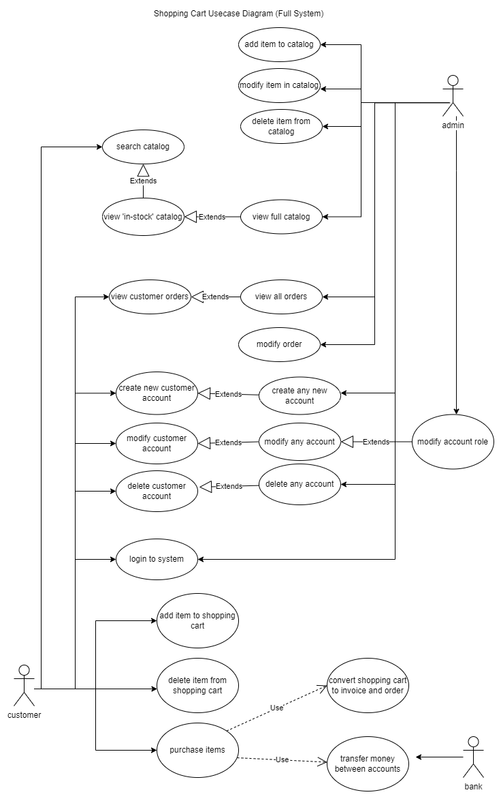
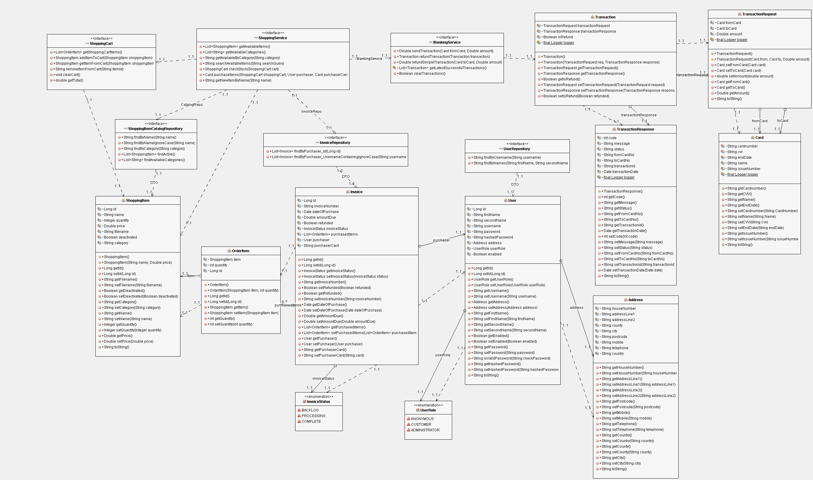
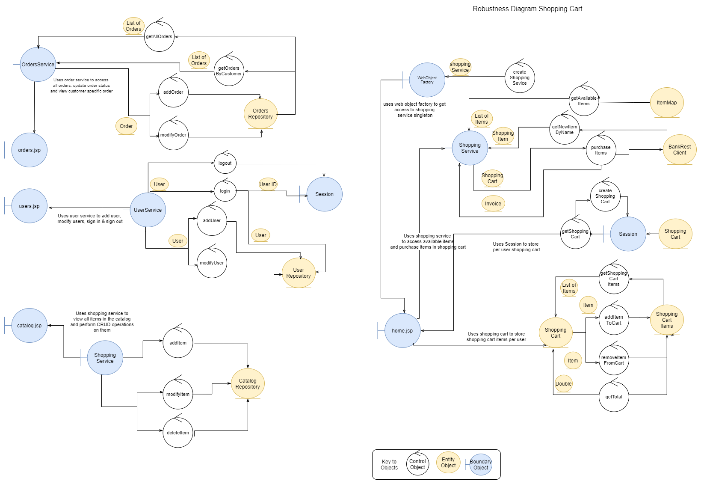
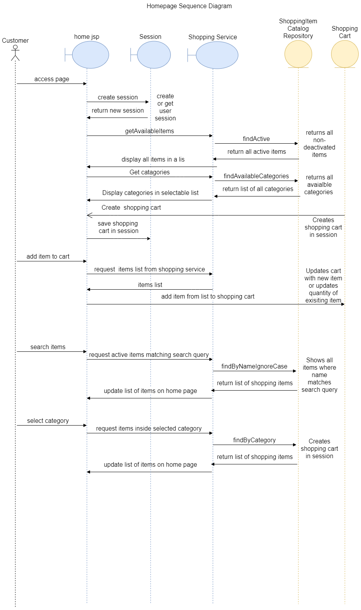

This design doc contains all the pre-development work needed in order to plan the project.

# Use Cases
Below are the use cases for the application from the point of view of 4 different users:  
`Anonymous` - A user who has not logged in  
`Customer` - A user who has logged in  
`Deactivated` - A user whose account is closed  
`Admin` - A user with elevated privileges

| Use case ID 	| Role  	 | Action | Software Reaction |
| ----------- 	| ---------- | ----------- | ----------- |
| UC1.1			| Anonymous/Customer  | User loads the site | The application displays a page with all items that are in stock |
| UC1.2			| Anonymous/Customer  | User searches for an item | The application displays a page with all available items that match the search criteria |
| UC2			| Anonymous/Customer  | User adds item to cart | The application adds the item to the cart or increases the quantity of an existing item by 1 |
| UC3			| Anonymous/Customer  | User modifies cart | The application removes items from cart when selected by the customer to do so |
| UC4			| Anonymous  | User signs in  | The application stores the user in session storage |
| UC5			| Anonymous  | User signs up  | The application allows user to enter their details (name, address) and creates a new account in the database |
| UC6.1			| Customer  | User purchases the items in the shopping cart  | The application sends a request to the Bank REST API to pay for the goods and moves money from customer's bank account to the shop's account |
| UC6.2			| Customer  | User purchases the items in the shopping cart  | If the payment was successful the order is added to the database |
| UC6.3			| Customer  | User purchases the items in the shopping cart  | The items ordered have their stock count updated to match the new inventory |
| UC6.4			| Customer  | User enters incorrect card details  | The error is logged |
| UC6.5			| Customer  | User enters incorrect card details  | The user is displayed with an error message and the purchase does not create an invoice |
| UC7			| Customer  | User views their orders  | A page displaying all the user's orders is displayed along with their status |
| UC8			| Admin  | Admin adds a new item to the catalog  | The item is added to the database and is visible to customers |
| UC9			| Admin  | Admin removes an item from the catalog  | The item is no longer visible to customers |
| UC10			| Admin  | Admin updates an item from the catalog  | The item details change or the inventory count is updated |
| UC11			| Admin  | Admin views all orders  | The application displays an orders page showing all orders in the system along with their status |
| UC12			| Admin  | Admin searches all orders  | The application displays all orders that contain products matching the search query |
| UC13			| Admin  | Admin edits an order  | The admin is able to change the status of an order |
| UC14			| Admin  | Admin views all users  | The application shows a list of all users in the system |
| UC15			| Admin  | Admin modifies a user | The application updates user accounts based upon the changes made by the admin |
| UC16			| Customer/Admin  | User logs out  | The application removes the current user from session and turns role back to anonymous |
| UC17			| De-activated  | User attempts to login  | The application blocks the user from logging in |

## Additional Features Use Cases
Note - these use cases have been added after development of all the original use case was completed. The Use Cases below are additional use cases on top of the original requirements in order to expand the functionality of the application.

| Use case ID 	| Role  	 | Action | Software Reaction |
| ----------- 	| ---------- | ----------- | ----------- |
| UC20			| Admin  | Admin uploads an image to an item in the catalog | Returning to the home page shows the images above each item |
| UC21		| Admin  | Admin adds a category to an item and clicks save | Returning to view that item shows the new category |
| UC22		| Customer  | Customer clicks on a category on the home page | Home page limits the item list to products that are in the selected category |
| UC23		    | Admin  | Admin clicks on an order and clicks refund | Money is transferred from the shopkeeper's bank account into the customers account |

# Test Plan
For this application I will provide Unit Tests to cover every low level element including Models, Services and Repositories using JUnit. This will, by itself, provide a large test coverage of the system. Unit tests alone however will only provide testing of individual components on their own. In order to provide integration testing, testing of components working together, I will perform manual User Interface tests. These tests not only make sure the UI is functional but also test the system as a whole - integrating multiple components of the system into single tests.  

For this application I have decided to write manual tests from the point of view of each of the Roles in the system

### Anonymous Tests
| Test case ID 	| Use case ID  | Action  	 | Expected Result | Date Passed |
| ----------- 	| ---------- | ---------- | ----------- | ----------- |
| TC1			| UC1 | New user loads up the site  | All products are available to be viewed on this page | Passed - 14/12/21 |
| TC2.0			| UC1.2 | New user searches for a product  | All products matching the search criteria are displayed | Passed - 14/12/21 |
| TC2.1			| UC1.2 | New user searches for a product that is out of stock  | The product is not displayed | `Failed` - Requirements have changed for out of stock items to still be displayed, only Deactivated items should not be displayed.  |
| TC2.1v2			| UC1.2 | New user searches for a product that is Deactivated  | The product is not displayed | Passed - 14/12/21  |
| TC3.0    		| UC2 | New user adds an item to their cart  | Heading to the cart page shows the product in the cart | Passed - 14/12/21 |
| TC3.1    		| UC2 | New user adds the same item to their cart again  | Heading to the cart page shows the product quantity has increased by 1 | Passed - 14/12/21 |
| TC4   		| UC3 | New user removes item from cart  | Quantity of item in cart is decreased by 1 | Passed - 14/12/21 |
| TC5.0   		| UC5 | New user clicks "login or create a new account" and then clicks "create a new account"  | Page loads containing all required inputs for a new account to be created | Passed - 14/12/21 |
| TC5.1   		| UC5 | User enters account details and submits  | Account is created and user is logged in automatically | Passed - 14/12/21 |
| TC5.2 		| UC5 |  User clicks on cart  | Items are still stored in the cart and are not lost | Passed - 14/12/21 |
| TC6   		| UC5 & UC4 | User clicks logout  | Account is no longer associated with the session | Passed - 14/12/21 |
| TC7.0   		| UC4 | User clicks login  | Page loads with all required inputs for sign in | Passed - 14/12/21 |
| TC7.1   		| UC4 | User enters account details  | User is automatically logged in to their account | Passed - 14/12/21 |

### Customer Tests
The following tests must be performed by a logged in user. These tests must be completed as well as the following anonymous tests which must be re-tested as the customer role:  
-  `TC1`, `TC2`, `TC3`, `TC4` (Passed - 14/12/21)

| Test case ID 	| Use case ID | Action  	 | Expected Result | Date Passed |
| ----------- 	| ---------- | ---------- | ----------- | ----------- |
| TC10			| UC6.1 | User clicks on shopping cart and clicks checkout  | Page loads for user to enter card details | Passed - 14/12/21 |
| TC10.1		| UC6.2 | User enters valid card details  | Success message is shown | Passed - 14/12/21 |
| TC10.2		| UC6.2 | User enters valid card details  | Money in the Bank Rest API has been moved to the correct account | Passed - 14/12/21 |
| TC10.2.2		| UC6.3 | User enters valid card details  | The Quantity of the item in inventory is reduced | Passed - 14/12/21 |
| TC10.3		| UC6.4 & UC6.5 | User enters invalid card details  | Error message is shown | Passed - 14/12/21 |
| TC11		    | UC7 | User clicks on the orders page  | All the user's orders as well as their status are displayed | Passed - 14/12/21 |

### Admin Tests
| Test case ID 	| Use case ID | Action  	 | Expected Result | Date Passed |
| ----------- 	| ---------- | ---------- | ----------- | ----------- |
| TC20.1			| UC8 | Admin clicks add item on the catalog page  | Page loads for admin to enter product details for item | Passed - 14/12/21 |
| TC20.2		| UC8 | Admin enters all the required info for an item and clicks save  | The product is viewable on the catalog page | Passed - 14/12/21 |
| TC21	    	| UC9 | Admin deletes an item  | The product is no longer viewable in the catalog page | `Failed` - Requirement changed to be able to deactivate an item instead of deleting an item in order to retain the item in the database in order to stay visible on user's orders |
| TC21v2	    	| UC9 | Admin deactivates an item  | The product is no longer viewable in the catalog page | Passed - 14/12/21 |
| TC21.1    	| UC9 | Admin deletes an item  | The product is still visible in orders that contain it | `Failed` - Requirement changed to be able to deactivate an item instead of deleting an item in order to retain the item in the database in order to stay visible on user's orders   |
| TC21.1v2    	| UC9 | Admin deactivates an item  | The product is still visible in orders that contain it |  Passed - 14/12/21  |
| TC22      	| UC10 | Admin updates an item's detail | The product's details are updated in the catalog page | Passed - 14/12/21  |
| TC23      	| UC10 | Admin changes a product's quantity to 0 | The product is no longer displayed on the catalog page  | `Failed` - Requirement changed to still show out of stock items - just to mark them as out of stock |
| TC23v2      	| UC10 | Admin changes a product's quantity to 0 | The product is displayed as "item out of stock"  | Passed - 14/12/2021 |
| TC23.1     	| UC10 | Admin changes a product's quantity back to a number greater than 0 | The product is viewable again from the catalog page and able to be added to the shopping cart | Passed - 14/12/2021 |
| TC24      	| UC11 | Admin opens the orders page | A page loads containing all the orders  | Passed - 14/12/2021 |
| TC25      	| UC12 | Admin searches the orders page | Page results are limited based upon those that match the search query  | Passed - 14/12/2021 |
| TC26      	| UC13 | Admin clicks edit on an order | The order loads, allowing the Admin to change the order status  | Passed - 14/12/2021 |
| TC26.1      	| UC13 | Admin changes the status of the order and clicks update | The order on the user's account shows the new updated state  | Passed - 14/12/2021 |
| TC27      	| UC14 | Admin clicks on the users page | A page loads containing all the users in the system  | Passed - 14/12/2021 |
| TC27.1     	| UC15 | Admin clicks modify user on the users page | A page loads containing all information about the user  | Passed - 14/12/2021 |
| TC27.2     	| UC15 | Admin edits user's details | The details are changed on the user's my profile page  | Passed - 14/12/2021 |
| TC27.3     	| UC16 | Admin edits user's state to de-activated | The user is unable to log in to the system  | Passed - 14/12/2021 |

### De-activated Tests
| Test case ID 	| Use case ID | Action  	 | Expected Result | Date Passed |
| ----------- 	| ---------- | ---------- | ----------- | ----------- |
| TC30			| UC17 | De-activated user tries to login  | Message is shown to let the user know their account might be locked | Passed - 14/12/2021 |

## Additional Features Tests
Note - the following tests have been added to match the additional feature use cases above. These tests, along with the use cases, were added after all development of core features was complete.

| Test case ID 	| Use case ID | Action  	 | Expected Result | Date Passed |
| ----------- 	|  ----------  | ---------- | ----------- | ----------- |
| TC40.1			| UC20 | Admin clicks Choose File on modify item page, then chooses an image file locally and then clicks save | Popup appears allowing user to select image file, selecting file populates chosen file name & clicking save shows success message | Passed - 14/12/2021 |
| TC40.2			| UC20 | User searches for the above item | Item details are shown along side the image being displayed | Passed - 14/12/2021 |
| TC41			| UC21 | Admin enters category on modify item page, then clicks save | "Successfully updated" message is displayed and category is saved | Passed - 14/12/2021 |
| TC42.1			| UC22 | User loads up homepage after category is added  | Added category is shown in the list of categories | Passed - 14/12/2021 |
| TC42.2			| UC22 | User clicks on a category of their choice  | Home page items are filtered down based upon the category selected | Passed - 14/12/2021 |
| TC43.1			| UC23 | Admin clicks "View/modify Order" on modify order page  | Order details are loaded alongside a "Refund" and "Update" button | Passed - 14/12/2021 |
| TC43.2			| UC23 | Admin clicks "Refund"  | IsRefunded status changes to true and success message is displayed to user | Passed - 14/12/2021 |
| TC43.3			| UC23 | Admin checks bank balance from external bank application | Balance is updated to move money from shop holder card to user's card | Passed - 14/12/2021 |

# Features
Below you can see the feature list for the application, this list is split into sections - grouped by either the pages the feature will be on or the group of pages they relate to. I have also included "Potential Additional Features" for each page - these are to be started if development of all core features is completed and tested. Not all the Additional Features will get started but they provide a path forward to improve the application in future phases.

### Home View
- List of all products ✅
- Ability to add product to cart ✅
- Ability to search products to filter list down ✅

Potential Additional Features (for future phases):
- Display images for each product ✅
- Filtering of products based upon their category ✅
- Add pagination to result (don't load all products at once)

### Orders View
- View all orders associated to account ✅
- View status & price of order as well as products it contains ✅
- As Admin - Search orders to filter list down ✅
- As Admin - View all orders from all users ✅
- As Admin - Edit status of order ✅

Potential Additional Features (for future phases):
- As Admin - Refund an Order ✅

### Catalog View
- As Admin - View all items in the catalog ✅
- As Admin - Add new item to catalog ✅
- As Admin - Modify Item Quantity ✅

Potential Additional Features (for future phases):
- Add ability to add a category to each product ✅
- Add the ability to add a 'sale price' which shows differently on the homepage

### Shopping Cart View
- View all products & their quantity in the cart ✅
- View total cost of shopping cart ✅

Potential Additional Features (for future phases):
- Be able to add coupon code to shopping cart to add discounts

### Checkout View
- Enter & Submit card details for transaction ✅
- Card details are validated & rest client sends money ✅

Potential Additional Features (for future phases):
- Load card details from account (only require entering of CVV)

### Users 
- Create a user ✅
- Login to an account ✅
- Edit account details ✅
- Logout of account ✅
- As Admin - Edit account details & state of any user ✅

# UML Diagram
## Use Case Diagram
Below you can see the Use Case Diagram for the application. From the diagram you can see the 2 main actors, the User and the Admin, as well as a 3rd Party Actor - the bank. The diagram shows the possible actions of each actor and how each role extends actions from the other role.

## Class Diagram
Below is the full class diagram for the application. As you can see there are 3 key layers - the Services (Shopping Cart, Shopping Service & Banking Service), the Data Access Repositories (ShoppingItemCatalogRepository, InvoiceRepository, UserRepository) as well as the "data transfer object" (dto) layer which includes all the models used for the shopping repositories as well as the banking API.

1 key thing to notice from the diagram is the use of an Order Item as well as a Shopping Item. From the diagram you can see that the invoice has a direct relationship to the Order Item but not the Shopping Item. This is due to the fact that the Shopping Item contains a single quantity property used for holding the quantity of items available to purchase however there is no property to hold the quantity of an item contained in a single order. Due to the fact that the model properties relate directly to columns in our DB we need a new table for joining the relationship between a shopping Item and an invoice. My solution to this is the OrderItem. This item simply holds a reference to a shopping item and an Int showing the quantity of that Item that was purchased. By doing this we create a new Database table successfully joining shopping items to invoices with unique quantities per order.  

## Robustness Diagram
Here is the robustness diagram for the whole system. Here we can see how each page is setup and how different objects interact with each other.

## Sequence Diagram
Here is the sequence diagram for the home page of the application. Here you can see the different request to the page including GET requests and how these requests interact with other layers of the application including the session, service layer and data access layer.

# Development

## Coding Standards
For this application I will use JavaDoc in order to comment all classes & methods in order to provide detailed explanation in what they do. I will also use JUnit to unit test all classes as well in order to maintain great test coverage.

## Git & SDLC Strategy
For this project I will keep track of my backlog through the use of Github Projects. I will be implementing Agile practices into my development lifecycle for this project and will hence use the Github Projects board as my backlog of tasks.  

I will then also setup a Continuous Integration pipeline within my Github Project in order to automatically build by application and run through all the unit tests. By doing this I will be able to identify issues in my code before the code is pushed to the master branch.

In order to keep track of releases I will also be using Github Releases which natively use Git tags.

# System Overview
This application is built with Java technologies and uses Maven as its build system. Using a build system like maven means that project dependencies are automatically added to the project simply by reading the pom files. Maven also allows multi-module projects meaning I can compile my Business Logic Projects to Jar files while compiling my web project to a single WAR file to be run in Tomcat.

This system will be built using the MVC architecture which is based on 3 main elements - Model, View & Controller. The use of MVC enables better organization of the project which in turn leads to cleaner code and easier expansion of additional features. The MVC framework I will be using for this application is Spring MVC.

## Model Layer 
For the model layer of the application I will use basic DTO (data transfer objects) which will be persisted in a database through the use of Spring Data JPA. These data repositories provide a simple data access layer to the application that allows data queries to be created either manually or through convention.

The benefits of using Spring Data is that they provide a layer of abstraction above direct database connections & queries - meaning I can focus my development time more on features for the application rather than writing database connection code and database queries.

Due to the fact this application will have the ability for users to sign in - I need a way to securely store user passwords. This is due to the fact that passwords should never be stored in plaintext anywhere in your application (including your database). In order to overcome this I will implement BCrypt to hash passwords which will then be stored in the database. This allows my application to simply compare hashes of passwords rather than ever having to work with passwords in plain text.
The benefit of using hashing is that a hash function is a one way function meaning that once the password is hashed, there is no way to get the original password back (without brute forcing it). 

## Controller Layer
For this application our business logic will be done at the controller layer. Each page in our application will have a controller which will fetch data from the database (through our model layer) and send it to our view layer. When the user changes data through the view it will then be passed back to our controller in order for the model/data access layer to update/save the changes. Simply put, our controller connects our persistence layer to our view.

By using MVC over pure JSPs I get the benefit of abstracting my business logic away from the page itself. Making the code for the views much cleaner and also helping to reduce duplicate code.

By using Spring for MVC I gain the benefits of Dependency Injection which allow me to annotate certain classes as Services or Components and simply 'Autowire' these into my controllers. This means that I can eliminate my use of Factories and simply provide singletons through "scope" annotations on the classes themselves.

For the services and repositories in my application, I am using the Facade pattern which hides the complexity of the class through the use of interfaces. For the services, I will create the interfaces first and then write the business logic behind them. However for the repositories, Spring Data allows me to simply write the interface and it'll auto-generate the code for the repository for me.

## View Layer
For the views for this application I will still use JSPs however I will also use JSTL (JavaServer Pages Tag Library). The tag library will allow me to add logic such as if statements or foreach loops to my views in order to enumerate through the data provided by the controller and conditionally show parts of the page. By using MVC these views will focus mainly on the UI of the application and will leave the business logic code to be implemented by the controllers and services

